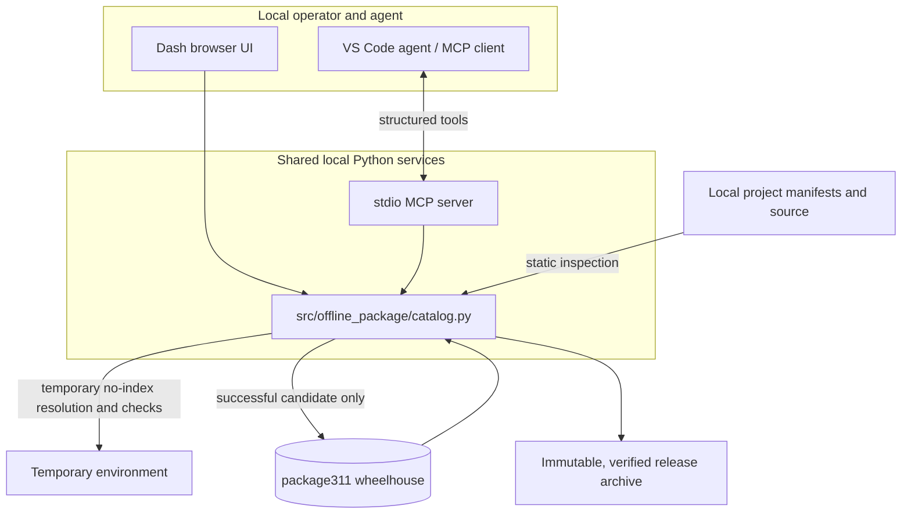

# Python 3.11 Offline Package Governance

> A local-first system for auditable dependencies, repeatable offline installs, and human-controlled package admission on Windows x64.

## Problem

Disconnected Windows environments need more than a pile of wheel files: operators must know what is present, what licenses were declared, whether a project can resolve offline, and whether a new artifact installs without silently replacing an existing version.

## What This Project Delivers

| Capability | Operator outcome | Evidence / control |
| --- | --- | --- |
| Offline deployment | Install from the local Python 3.11 wheelhouse | Explicit no-index installer and dependency check |
| Package governance | Review artifact counts, license evidence, application domains and notices | Local metadata inspection with JSON/CSV reports |
| Project analysis | Derive declared or import-based requirement candidates and resolve closure | AST parsing without executing the project; target-specific offline pip dry run |
| Agent integration | Let local agents search, inspect and run bounded checks | Standard MCP stdio transport, structured results, directory allow-list |
| Controlled admission | Test then add a candidate wheel | Human-reviewed preview digest, RECORD validation, temporary environment, offline install, `pip check`, atomic no-overwrite commit |
| Reproducible release | Publish and verify immutable bundles | Per-file and archive SHA-256 manifests; existing release directories rejected |

## Design



## Run

Requirements: Windows x64, CPython 3.11, and the local `package311/` wheelhouse.

```powershell
.\.venv\Scripts\python.exe -m pip install --no-index --find-links .\package311 --only-binary=:all: -r .\requirements-ui.txt -r .\requirements-mcp.txt
.\run_dashboard.bat
```

For agent access, VS Code reads `.vscode/mcp.json`; install the MCP dependencies first. Detailed workflows and allow-list configuration are in [OFFLINE-MCP.md](docs/operations/OFFLINE-MCP.md). For a concise test run use `run_tests.bat`; the separate installer integration/release gate is documented in [OFFLINE-RELEASE.md](OFFLINE-RELEASE.md).

## Repository Map

- Root `.bat` installers, `pwistron.txt`, and `package311/`: compatibility-preserved offline deployment inputs.
- `src/offline_package/`: shared catalog, Dash/MCP adapters, and package-local UI assets.
- Root `offline_catalog.py`, `offline_dashboard.py`, `offline_mcp.py`: compatibility import/CLI shims.
- `offline_release.py`: immutable release builder and verifier.
- `tests/`: generated-wheel unit tests and the separate installer integration test.
- `docs/`: architecture and offline operations; root `OFFLINE-*.md` guides give user workflows.
- `config/`: adapter and development dependency manifests; root `requirements-*.txt` files preserve old commands.
- `.vscode/`, `pyproject.toml`, `.editorconfig`, `docs/development/`: repeatable local development and review conventions.
- `package311/`, `download/`, `bk/`, `release/`: local artifact/data areas, not source modules; binary-heavy areas are excluded from source-control and editor indexing.

## Honest Boundaries

- License and copyright metadata are declarations, not legal clearance or publisher authentication. Review actual LICENSE/NOTICE texts and redistribution obligations.
- A venv is not an OS security sandbox. Installation can run code with the current user's privileges; examine unknown publishers in a disposable VM.
- Domain tags and AST import mappings are candidates. They do not prove that a package suits a use case or that every runtime dependency has been discovered.
- Offline resolution and `pip check` establish installability/dependency consistency for the tested interpreter and wheelhouse; they do not prove application correctness or certify a release by themselves.

See [CONTRIBUTING.md](docs/development/CONTRIBUTING.md) for quality gates and [docs/ARCHITECTURE.md](docs/ARCHITECTURE.md) for component boundaries and invariants.
