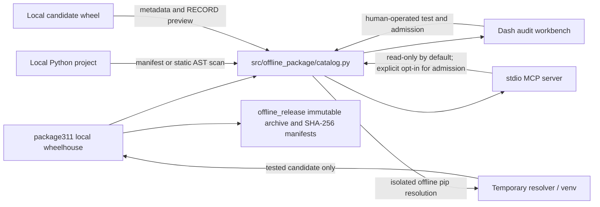

# System Architecture

## Scope

The repository provides a Windows x64 / CPython 3.11 offline wheelhouse, dependency and license evidence workflows, agent-facing local MCP tools, and immutable release archive verification. Dash and MCP are independent adapters over one shared catalog/service layer.

## Components

### Domain layer: `src/offline_package/catalog.py`

- Inspects wheel METADATA, WHEEL and RECORD without importing packages.
- Reads source archive `PKG-INFO` as evidence only; source archives are not installable resolver inputs.
- Classifies declared licenses and application domains from package metadata and explicit local rules. Unknown evidence remains visible as unknown.
- Discovers declared project requirements or candidates from a static Python AST scan.
- Resolves requirements against a temporary wheelhouse copied/hard-linked from compatible local wheels, with pip offline flags and dry-run reports.
- Admits a wheel only after safe archive/RECORD checks, temporary offline installation and `pip check`; successful content is atomically committed without overwrite.

### Adapters

- `src/offline_package/dashboard.py` provides a loopback-only Dash UI for inventory, audit evidence, project dependency inspection, and operator-directed admission. Its CSS is packaged under `src/offline_package/assets/`.
- `src/offline_package/mcp_server.py` exposes structured stdio tools and an `offline://policy` resource for local agents. Reads and checks are available by default; the destructive admission tool is absent unless the operator starts the server with `--enable-admission`.
- Root `offline_catalog.py`, `offline_dashboard.py`, and `offline_mcp.py` are compatibility launch/import shims for existing commands, tests and VS Code settings. New implementation belongs in `src/offline_package/`.
- `offline_release.py` validates fixed root-level release inputs, creates immutable archives and verifies outer/inner SHA-256 manifests.

## Core Invariants

1. `package311/` is the only resolver/install source. No network index, URL requirement, source build, or host-installed package may satisfy resolution.
2. Inspection does not import project code or candidate package modules.
3. A license declaration, classifier, digest or application-domain tag is evidence, not publisher authentication, malware analysis, suitability approval or legal advice.
4. AST import mappings are candidates, not a mathematically complete minimum. Dynamic imports, plugins, optional extras and runtime behavior require review.
5. Wheel admission is an explicit privileged action. A venv executes code as the current OS user and is not a security sandbox.
6. Failed admission leaves the repository unchanged. Existing wheel files and release bundles are never overwritten.
7. Release-required files remain at the repository root because the release verifier validates their paths.

## Verification Layers

- Unit and MCP transport tests: `run_tests.bat` or `python -m unittest discover -s tests -p "test_offline_*.py" -v`.
- Static checks: `ruff check .` using repository `pyproject.toml`.
- Installer release gate: `python tests/test_uv_autoinstall.py` in 64-bit Windows CPython 3.11 with the actual wheelhouse.
- Archive gate: build and run `offline_release.py verify` using a new release ID. Never rewrite an existing release directory.
- Package layout gate: build a wheel and inspect it to confirm the package CSS is included; do not rely only on source-checkout asset paths.
